# 系统运行时截图

本文档按功能模块整理了 Markdown Preview 站点的完整运行时界面截图，每个截图附有功能介绍，并指向 `docs/examples/` 中对应的详细示例文档。特殊页面会额外标注访问 URL。

---

## 一、整体界面

### 首页整体展示

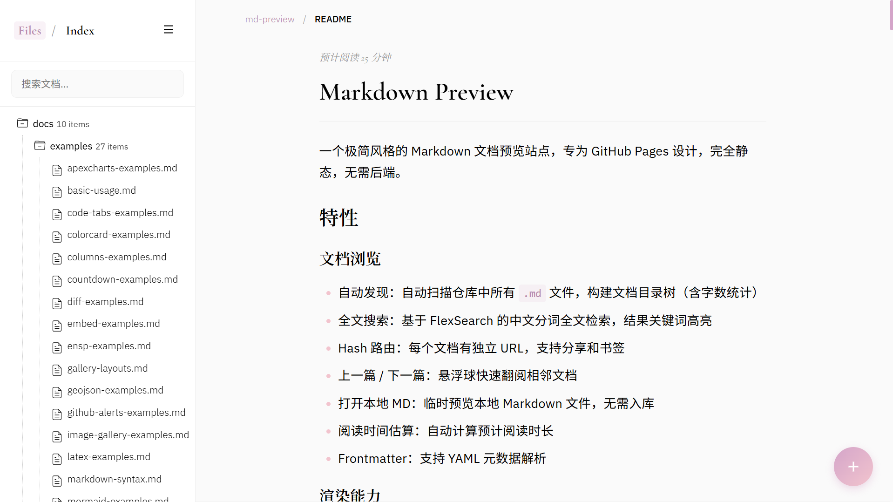

站点默认以左侧文档目录树 + 右侧正文阅读区的两栏布局呈现。侧边栏自动扫描仓库中所有 `.md` 文件，构建嵌套目录结构并显示字数统计；顶部显示面包屑路径与搜索框；右上角悬浮球提供回到顶部、上一篇/下一篇、打开本地 MD、安装 PWA、编辑此页、设置等快捷入口。

相关文档：
- [快速开始](getting-started.md)
- [基础使用示例](examples/basic-usage.md)
- [Markdown 语法总览](examples/markdown-syntax.md)

---

## 二、Markdown 渲染能力

### LaTeX 数学公式

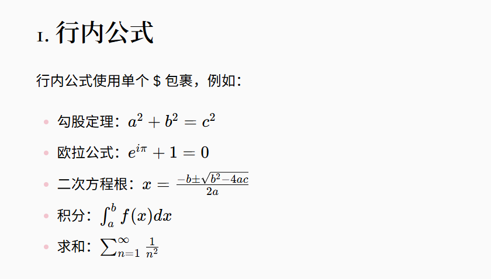

基于 KaTeX 引擎的数学公式渲染，支持行内公式 `$...$` 与独立公式块 `$$...$$`，涵盖矩阵、方程组、求和与极限、希腊字母等完整 LaTeX 语法。公式块支持主题配色自适应，暗色模式下自动切换对比度合适的颜色。

详细示例：[LaTeX 示例](examples/latex-examples.md)

---

### Mermaid 图表

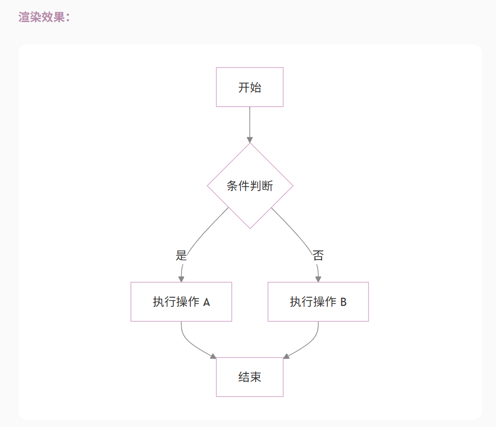

Mermaid 渲染器支持 18+ 种图表类型：流程图、时序图、类图、状态图、ER 实体关系图、甘特图、饼图、用户旅程图、思维导图、时间线、象限图、Git 提交图、区块图、C4 架构图、xychart-beta 等。图表颜色随文档站主题自动联动。

详细示例：[Mermaid 示例](examples/mermaid-examples.md)

---

### PlantUML 图表

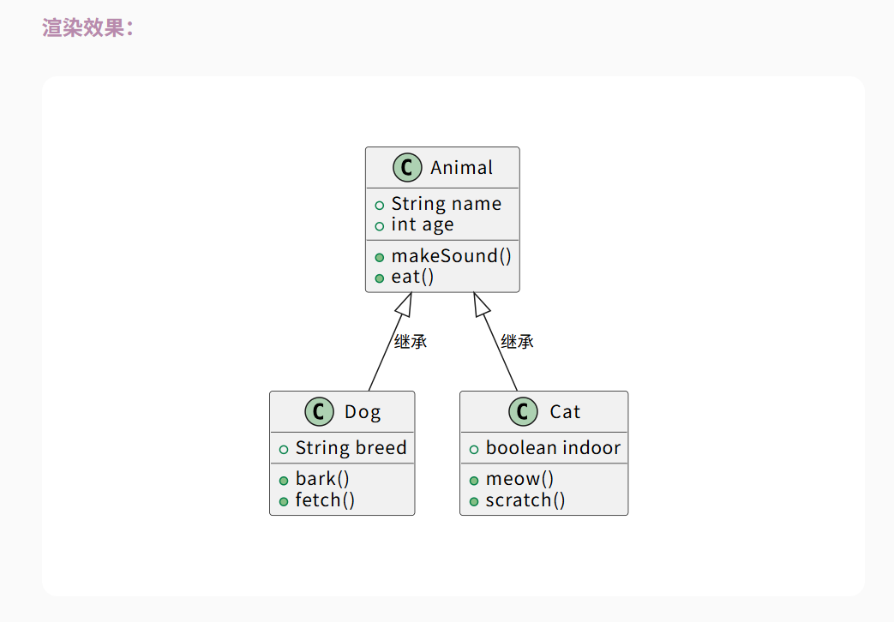

通过公共 PlantUML 服务器渲染 UML 系列图表：时序图、类图、用例图、活动图、状态图、组件图、部署图、思维导图、WBS 工作分解图、JSON 数据图、ER 图、线框图 salt 等 12 大类。

详细示例：[PlantUML 示例](examples/plantuml-examples.md)

---

### ApexCharts 动态图表

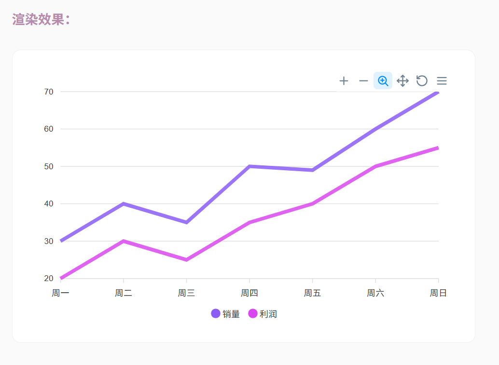

ApexCharts 交互式图表渲染器，涵盖 13 种常见类型：折线、面积、分组柱状、堆叠柱状、水平条形、饼图、环形 donut、雷达、散点、气泡、极坐标 polarArea、范围区域 rangeArea、烛台 candlestick。支持鼠标悬停数值提示、图例筛选、缩放平移等交互。

详细示例：[ApexCharts 示例](examples/apexcharts-examples.md)

---

### Git Diff 代码对比

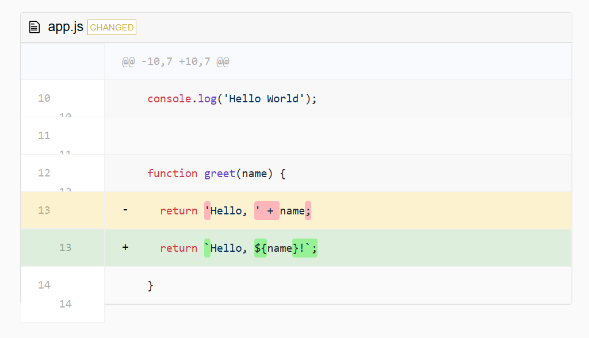

基于 Diff2Html 的 Git Diff 语法高亮对比，支持 Side-by-Side 并排视图与 Line-by-Line 逐行视图两种模式，新增/删除/修改行以不同颜色标记，变更字符级别高亮。

详细示例：[Diff 差异可视化](examples/diff-examples.md)

---

### GitHub 风格特殊引用块（Alerts）

兼容 GitHub 官方的 `[!NOTE]` / `[!TIP]` / `[!WARNING]` / `[!IMPORTANT]` / `[!CAUTION]` 五种提示块语法，每种类型拥有独立配色与语义化图标，视觉层级清晰。

详细示例：[GitHub Alerts 示例](examples/github-alerts-examples.md)

---

### Columns 多栏文本布局

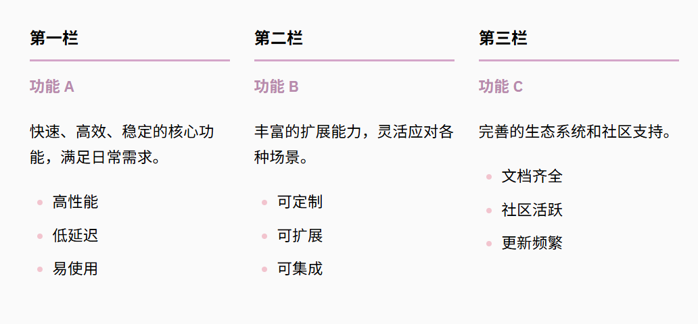

页面分栏布局语法，支持 2 栏 / 3 栏 / 多栏自定义宽度，栏间自动均分或按比例分配，用于左右对照、多列内容并排等场景，移动端自动折叠为单列。

详细示例：[Columns 分栏布局](examples/columns-examples.md)

---

### Code Tabs 多栏代码块（并排对比）

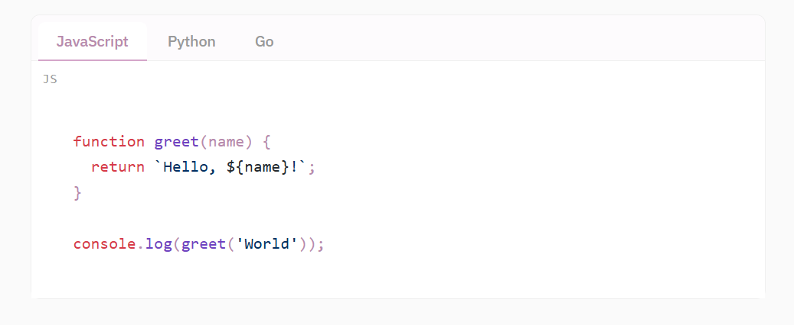

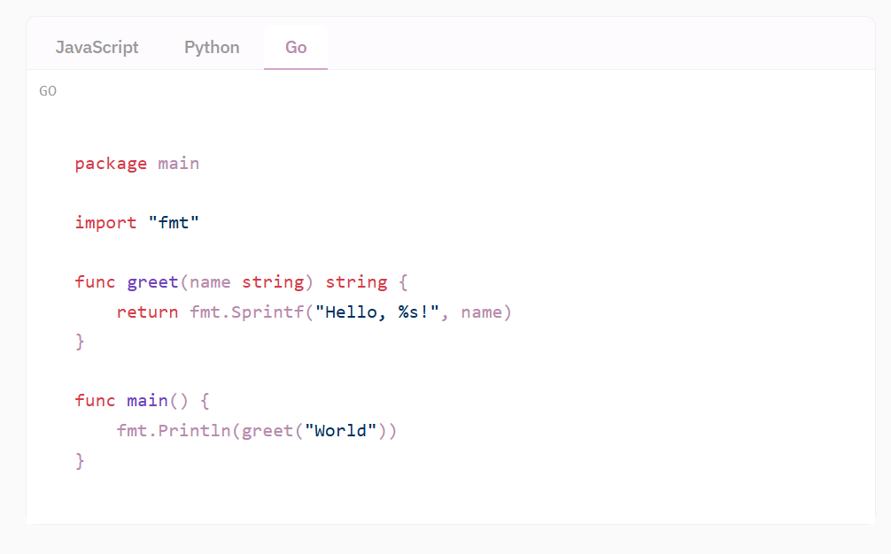

多语言代码并排标签页，适合同一逻辑的多种语言实现对比。支持点击 Tab 切换语言，每张 Tab 独立拥有复制按钮与语言标签。

详细示例：[代码 Tabs 示例](examples/code-tabs-examples.md)

---

### 长表格横向滚动优化

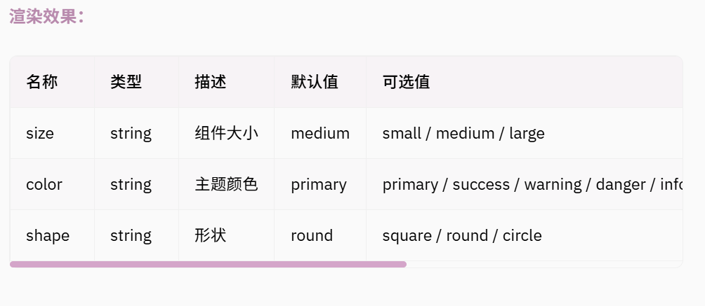

当表格列数过多、超出正文宽度时，自动包裹 `.table-wrapper` 并启用横向滚动条，表格行保持斑马纹与悬浮高亮，表头可固定视口顶部。

详细示例：[表格展示与优化](examples/table-examples.md)

---

### Spoiler 遮罩 / 剧透折叠块

内置剧透折叠块语法（Spoiler），支持两种展示模式：
1. 覆盖式遮罩：内容被色块覆盖，点击/悬停后渐变揭示文字
2. `
` 原生折叠：标题可点击展开/收起详细内容

详细示例：[Spoiler 折叠语法](examples/spoiler-examples.md)

---

### 图片画廊布局（多种 CSS 排布）

内置 17 种图片画廊 CSS 布局：`@grid` 网格、`@cardstack` 卡片堆叠、`@filmstrip` 胶片条、`@polaroid` 宝丽来、`@stack` 倾斜堆叠、`@mosaic` 马赛克、`@scattered` 散落、`@hexagon` 六边形、`@coverflow` 封面流、`@tape` 胶带、`@duotone` 双色、`@frame` 画框、`@arch` 拱廊、`@masonry` 瀑布流、`@slider` 轮播、`@ticket` 票根、`@panorama` 全景。

详细示例：
- [画廊布局说明](examples/gallery-layouts.md)
- [图片画廊功能示例](examples/image-gallery-examples.md)

---

### 二维码生成（插件）

插件系统的演示插件之一，使用 `qrcode` 代码块生成任意内容的二维码，尺寸、颜色、容错率均可配置。该插件主要用于验证自定义渲染器插件接口的正确性与兼容性。

详细示例：[二维码示例](examples/qrcode-examples.md)
插件开发：[插件开发指南](plugin-development.md)

---

### 倒计时器（插件）

插件系统演示插件之二，`countdown` 代码块渲染实时倒计时组件，支持设定目标日期时间，显示剩余天/时/分/秒，自动每秒刷新。到期后显示自定义完成文案。

详细示例：[倒计时组件示例](examples/countdown-examples.md)
插件开发：[插件开发指南](plugin-development.md)

---

### ColorCard 彩色卡片（插件）

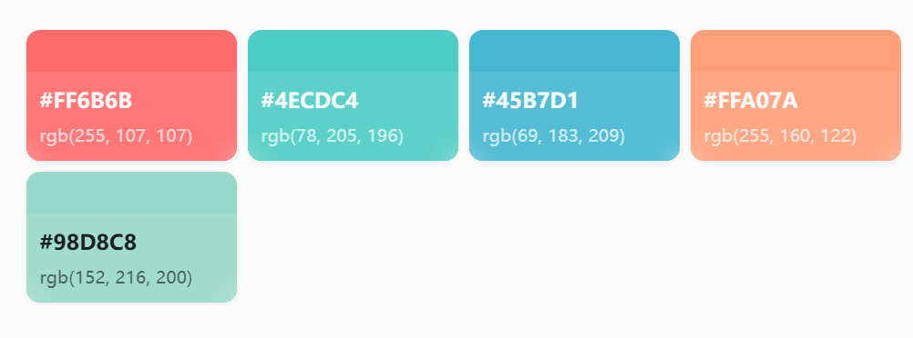

插件系统演示插件之三，ColorCard 以预设配色渲染彩色信息卡片，支持标题/正文/标签/按钮等结构化内容，用于产品特性总览、色板展示、亮点汇总等场景。

详细示例：[ColorCard 彩色卡片](examples/colorcard-examples.md)
插件开发：[插件开发指南](plugin-development.md)

---

### 视频嵌入（YouTube / Bilibili / Vimeo 等）

`@[youtube](id)` / `@[bilibili](bv-id)` / `@[vimeo](id)` 等嵌入语法，支持响应式 16:9 容器；同类服务还包括 Twitter 推文、GitHub Gist、CodePen / JSFiddle / StackBlitz / Replit 在线演示、Figma 设计稿、Google Maps / OpenStreetMap 地图、Google Docs 文档等 13 种外部嵌入服务。

详细示例：
- [外部嵌入综合示例](examples/embed-examples.md)
- [Twitter 推文嵌入示例](examples/twitter-embed-examples.md)

---

### X（Twitter）帖子嵌入（实验中 / 暂废弃）

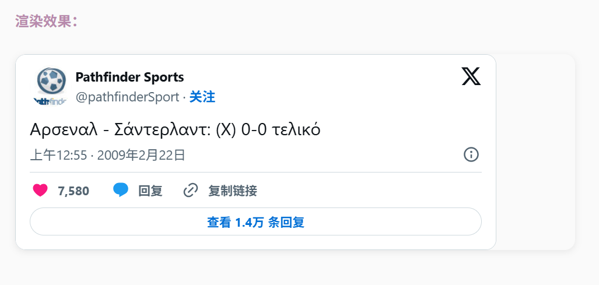

早期针对 X（原 Twitter）官方帖子的嵌入方案。因官方 API 与前端 SDK 变动频繁，目前主要推荐使用通用外部嵌入语法 `@[twitter]`。该截图保留作历史记录与 UI 参考。

详细示例：[Twitter 推文嵌入示例](examples/twitter-embed-examples.md)

---

### PPTX 演示文稿嵌入

通过 CI 构建流程（`iris/scripts/pptx/main.py`，基于 LibreOffice + Poppler/pdftoppm）将 `.pptx` 预处理为逐页图片。文档端以缩略图网格呈现，点击任意页面进入全屏放映模式，支持左右键/方向键翻页、回到网格等交互。

详细示例：[PPTX 嵌入与放映示例](examples/pptx-examples.md)

---

### 郊狼 Pulse 波形渲染（完整模式）

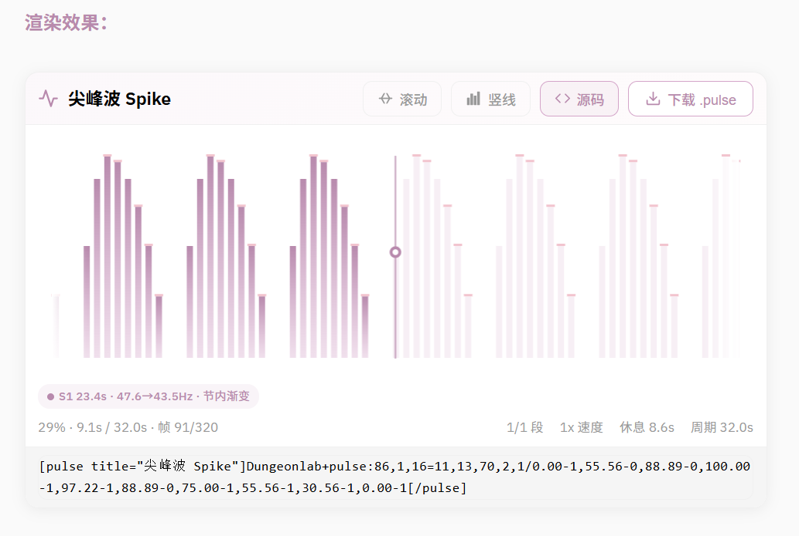

DG-LAB 郊狼设备 `.pulse` 波形文件的完整渲染器。基于 `Dungeonlab+pulse:` 官方格式解析，支持：
- **竖线 / 曲线** 两种显示模式切换
- **全局平铺 / 滚动播放头** 两种视图
- 小节边界粉色虚线（S1/S2...）、休息段灰色虚线
- 锚点脉冲粉色标记、普通脉冲锚点间自动线性插值
- 图例悬停显示小节参数（频率范围 / 时长 / 模式）
- 一键下载 `.pulse` 原始文件、展开查看完整标签代码

详细示例：[Pulse 波形示例（10+ 种波形）](examples/pulse-examples.md)

---

### 郊狼 Pulse 迷你波形（内联样式）

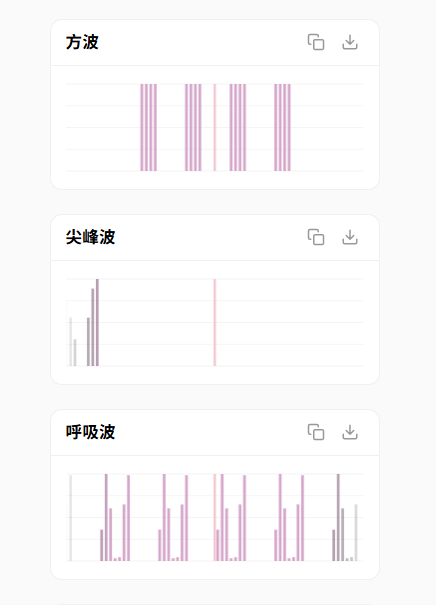

迷你波形 `[pulsemini]` 内联版本，尺寸约 220px 宽，固定为竖线 + 滚动模式，播放头位于中央。适合在段落文字中嵌入或批量展示多个波形。标题栏提供复制源码与下载 `.pulse` 图标按钮。

详细示例：[Pulse 波形示例 → 迷你波形章节](examples/pulse-examples.md#11-迷你波形内联样式)

---

### Cisco Packet Tracer 拓扑图（.pkt 解析）

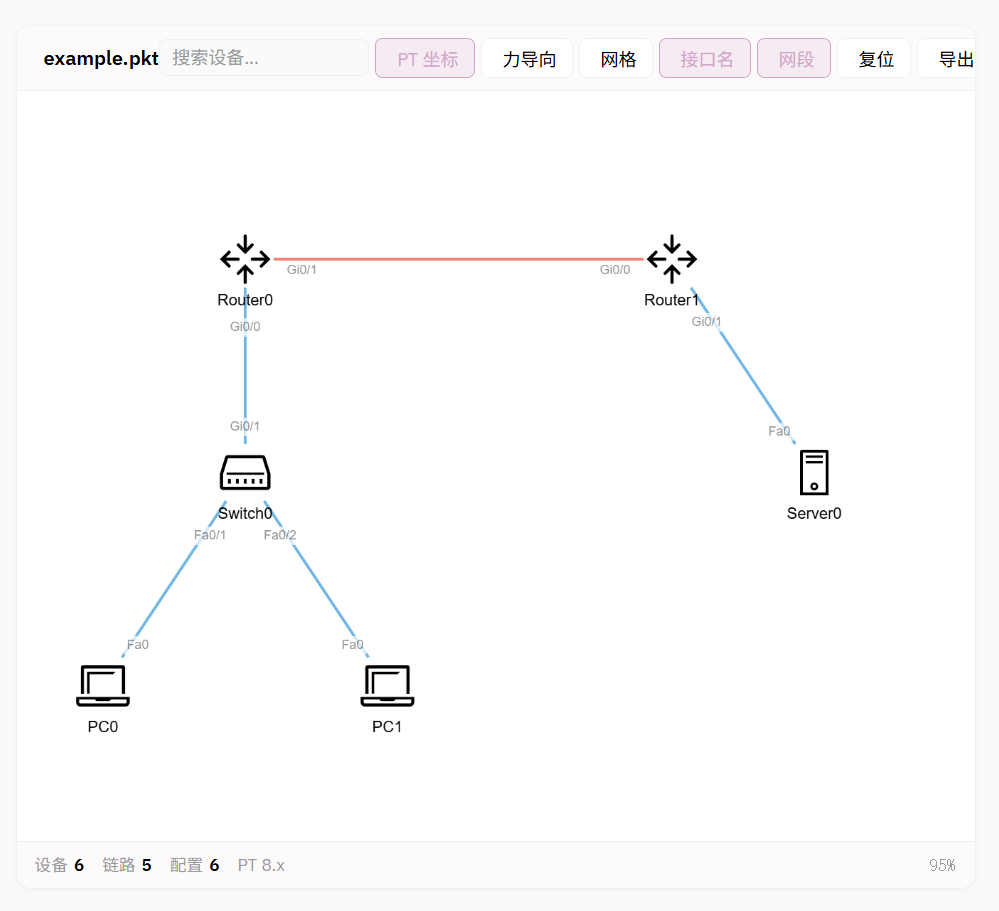

完整的 `.pkt` 文件解密解析管线 + Cytoscape.js 交互式渲染：5 个 Python 脚本零依赖实现 XOR/Twofish EAX 解密、zlib 多策略解压、XML + Cisco IOS 配置提取、分区化 JSON schema 输出。渲染端支持 13 种设备 SVG 图标、线缆颜色映射、搜索高亮、PT 坐标↔力导向布局切换、网格背景、导出 PNG/JSON/Markdown。

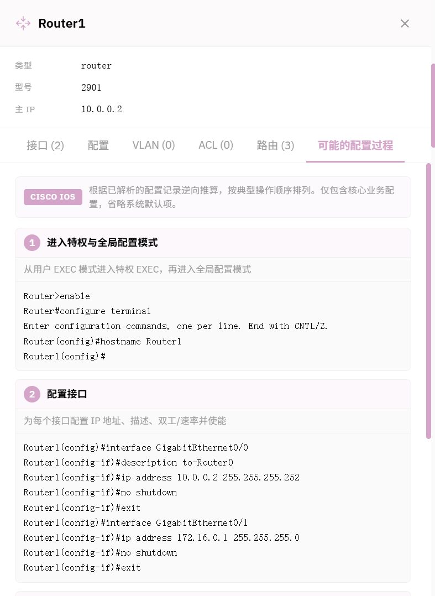

点击节点弹出右侧抽屉（移动端改为底部弹出），包含 5 个标签页：接口表、完整配置、VLAN 划分、ACL 访问控制列表、静态/动态路由表。代码实现自定义 IOS 语法高亮。

详细示例：[Packet Tracer 拓扑渲染示例](examples/pkt-examples.md)

---

### 华为 eNSP 拓扑图（.topo / .zip 解析）

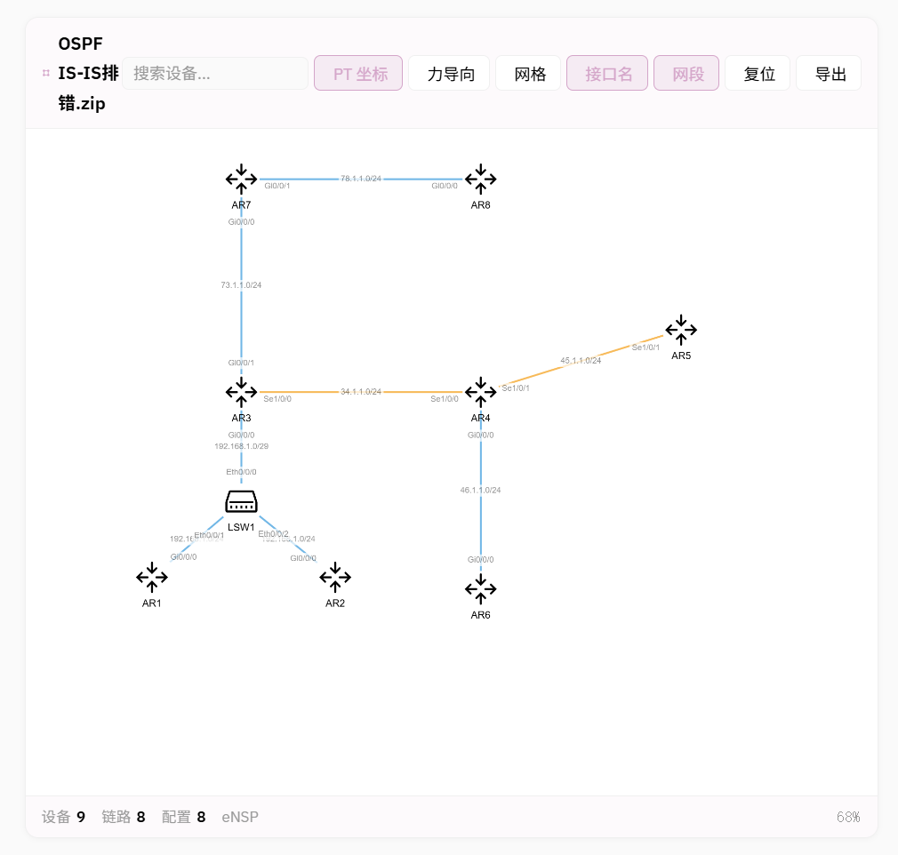

针对华为 eNSP 模拟器工程文件的解析管线。支持 `.topo` XML 与 `.zip` 压缩包两种格式，提取路由器、交换机、防火墙等网络设备及线缆连接关系，生成与 PKT 渲染器一致风格的 Cytoscape 交互式拓扑图。

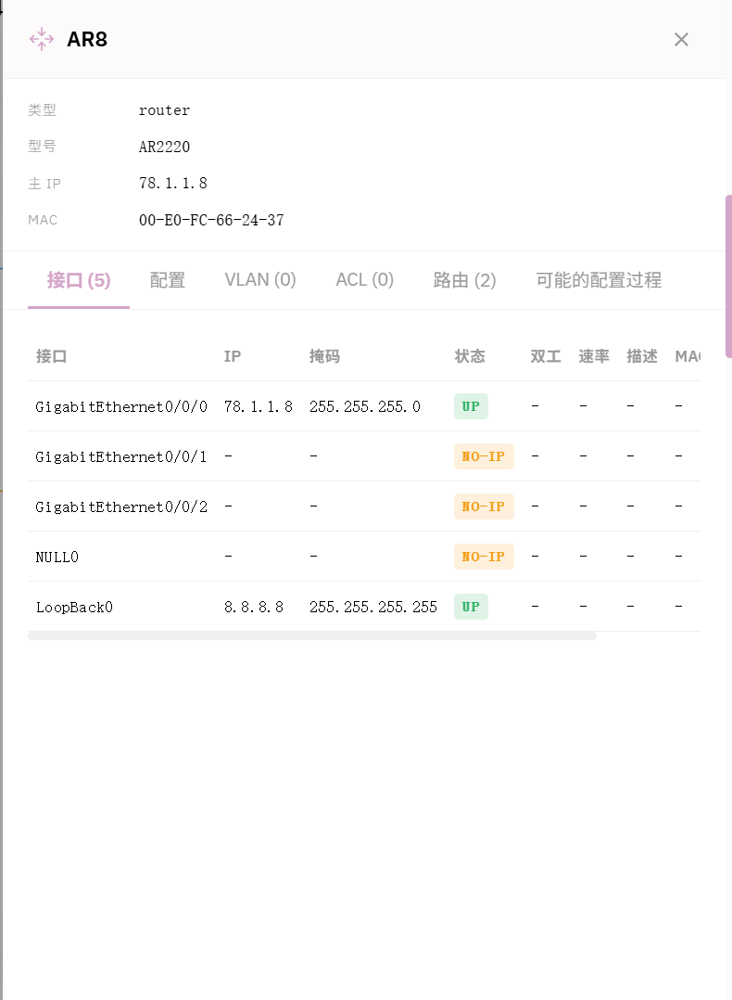

节点详情抽屉展示：设备接口表、VRP 配置文件、VLAN / ACL / 路由 等标签页，与 Cisco 版本体验保持一致。

详细示例：[华为 eNSP 拓扑示例](examples/ensp-examples.md)

---

## 三、设置面板

### 预设主题 + 自定义配色（取色器）

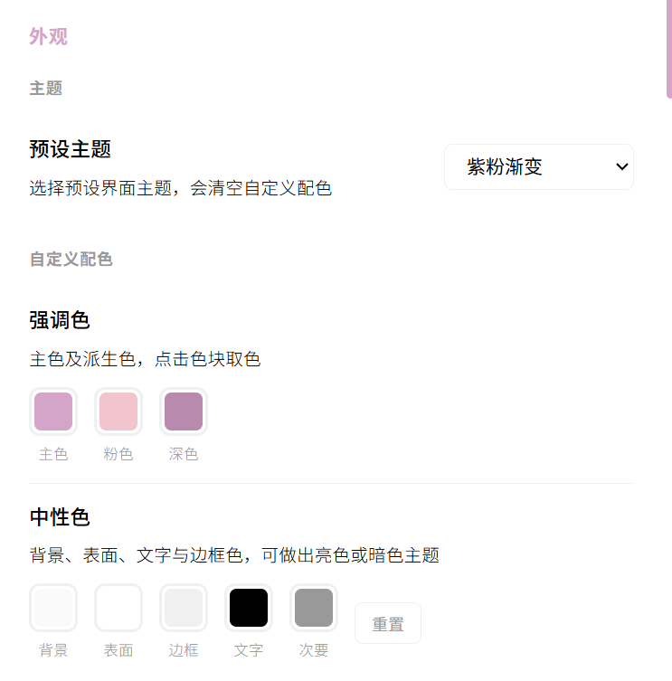

7 种内置主题（default / github-light / github-dark / notion / arc-dark / dracula / nord）一键切换；在此基础上提供：
- **强调色取色器**：主色 / 粉色 / 深色 独立调整
- **中性色取色器**：背景 / 表面 / 边框 / 文字 / 次要文字 五个维度，可自由组合亮色或暗色主题
- 所有配色持久化到 localStorage

详细文档：[主题定制](theme-customization.md)

---

### 字体/字号/字重/字色 精细控制

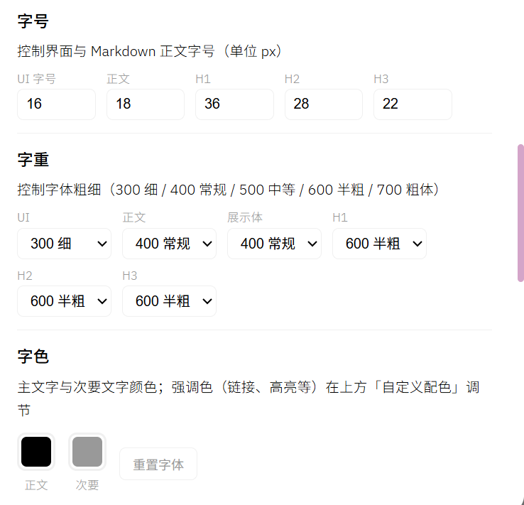

字体体系提供全方位细粒度控制：
- **远程字体 URL**：粘贴任意 Google Fonts / 自建 CSS URL 即可加载
- **字体族**：展示字体（标题衬线体）与正文字体（UI/正文无衬线体）自由填写
- **字号细调**：UI / 正文 / H1 / H2 / H3 五档独立设置
- **字重细调**：UI / 正文 / 展示体 / H1 / H2 / H3 六档独立选择（300~800）
- **字色**：正文与次要文字颜色独立取色
- 一键「重置字体」恢复默认

---

### 远程字体加载

设置 → 字体 → 远程字体 URL 输入框，粘贴任意远程字体服务的 CSS 地址（例如 Google Fonts 的 `@import` URL），回车后立即应用并持久化。适合使用私有字体 CDN 或公司标准字体的场景。

---

### 自定义页面 CSS / 代码高亮 CSS

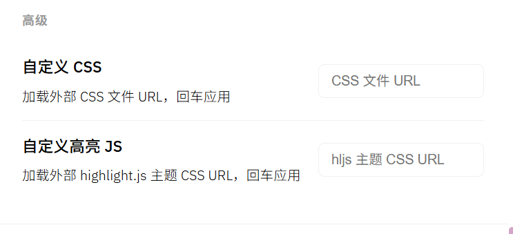

进阶用户的样式扩展能力：
- **自定义页面 CSS**：加载外部 CSS 文件，完全定制 Markdown 正文、侧栏、组件等样式
- **自定义代码高亮 CSS**：粘贴任意 highlight.js 主题 CSS URL，回车后即时替换代码块配色

---

### 预设代码高亮方案选择

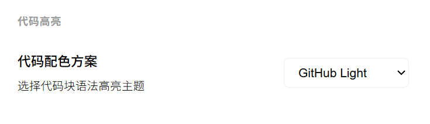

内置 10 套经典代码高亮主题，涵盖亮色与暗色：
atom-one-dark、atom-one-light、dracula、github-dark、github、monokai、nord、solarized-dark、solarized-light、vs2015

详细文档：[代码高亮主题](code-highlight-theme.md)

---

### 侧边栏显示选项微调

侧边栏相关的显示偏好：字数统计显示/隐藏、长文件名截断/展开切换、展开模式下横向滚动条隐藏（Shadow DOM 实现）等。

---

## 四、输出与订阅功能

### 导出文章为 Markdown 或 PDF

设置面板 → 操作 → 导出能力：
- **下载 Markdown**：下载当前打开的 `.md` 源文件
- **导出 PDF**：通过 `window.print()` + `@media print` 专用样式自动隐藏侧边栏/悬浮球等 UI，调用浏览器打印对话框，选择「另存为 PDF」即可

---

### PWA 可安装到本地

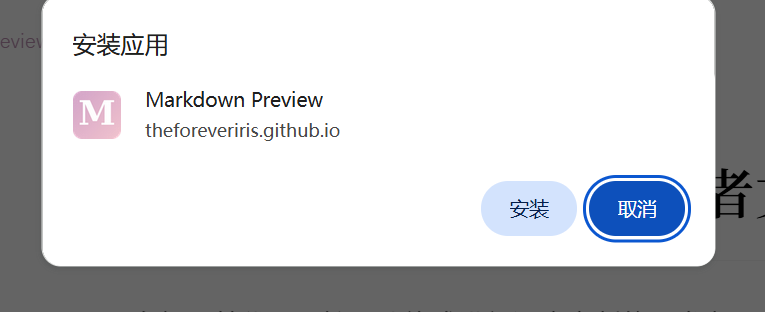

基于 Service Worker 的 PWA 能力：
- **可安装**：支持的浏览器中，悬浮球菜单出现「安装到桌面」按钮，一键安装为桌面应用或手机主屏幕
- **离线访问**：首屏静态资源预缓存；文档采用「网络优先 + 离线降级缓存」策略
- **更新提示**：检测到新版本资源时 toast 提示用户刷新页面
- 清单文件：根目录 `manifest.json`，Service Worker：`sw.js`

---

### 生成 RSS 订阅源

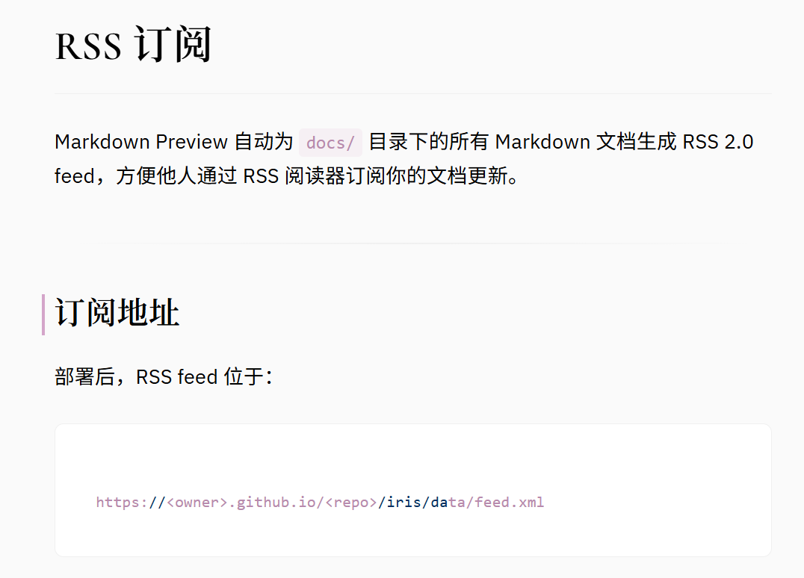

`docs/**` 目录变更时，GitHub Actions 自动运行 `iris/scripts/build-feed.js` 生成 RSS 2.0 规范的 `feed.xml`，并在 `index.html` 中通过 `<link rel="alternate">` 自动发现。用户可使用任何 RSS 阅读器订阅站点文档更新。

详细文档：[RSS 订阅](rss.md)

---

## 五、特殊页面

### 类 Jupyter Notebook 的内置 Markdown 编辑器

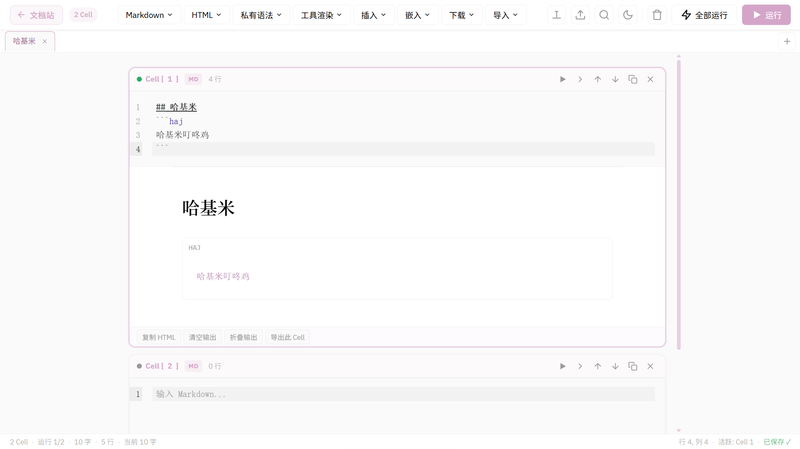

**访问 URL**：站点任意页面追加 `?mode=editor`，例如 `https://theforeveriris.github.io/md-preview/?mode=editor`

内置一个类 Jupyter 的 Cell 化 Markdown 编辑器，以全屏覆盖层叠加在文档站之上，特点包括：
- Cell 模型（markdown / plaintext 两种类型），每 Cell 独立编辑 + 渲染输出
- 运行当前（`Ctrl+Enter`）/ 全部（`Ctrl+Shift+Enter`）/ 此 Cell 及下方
- localStorage 自动保存（1.5s 防抖，刷新不丢内容）
- 11 类触发字符自动补全，120+ 条目
- 8 大工具栏下拉菜单：Markdown / HTML / 私有语法 / 工具渲染 / 插入 / 嵌入 / 下载 / 导入
- 2 列右键菜单（17 项操作）、视口边界自适应定位
- 跨 Cell 搜索替换（F3 / Shift+F3 导航）
- 导入导出：.md / .html / 内联 CSS HTML / .pdf / .mdnb 笔记本 / 合并 .md
- 4 档字号（12/14/16/18）、亮/暗主题独立切换

该页面同时承担「本站私有语法糖验证页」角色：编辑器内置的工具栏与自动补全覆盖了所有私有语法（画廊、Alerts、Pulse、PKT、PPTX 等嵌入），打开即可即时验证渲染结果。

详细文档：[Markdown 编辑器说明](editor.md)

---

### 郊狼波形批量生成页

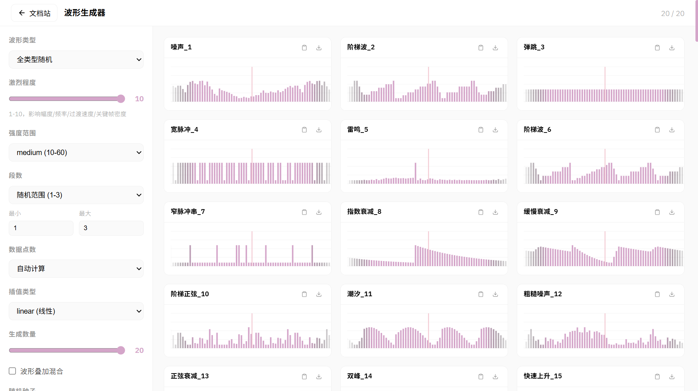

**访问 URL**：站点任意页面追加 `?mode=pulsegen`，例如 `https://theforeveriris.github.io/md-preview/?mode=pulsegen`

面向 DG-LAB 郊狼 `.pulse` 波形创作者的可视化批量生成工具：
- **9 大类 · 50+ 种波形模板**：脉冲类 / 基础波 / 自然类 / 衰减上升 / 噪声类 / 阶梯折线 / 组合类 / 特殊形状 / 氛围类
- **核心参数**：激烈程度 1~10 档、强度范围预设或自定义、小节数（固定/区间）、数据点数（自动/固定/区间）、插值类型（线性/缓入/缓出/缓入缓出）
- **叠加混合与随机种子**：可选波形叠加混合、支持任意种子字符串保证可复现
- **批量生成 1~20 个**：以 3 列网格展示迷你波形实时预览，每个提供复制源码与下载 `.pulse` 按钮

详细文档：[郊狼波形批量生成页说明](examples/pulse-generator-page.md)
Pulse 格式与示例：[Pulse 波形示例](examples/pulse-examples.md)

---

## 六、其他

### 占位图

编辑器「插入 → 占位图片」菜单提供的四种尺寸占位图模板：300×200、600×400、1200×600 横幅、500×500 方图，用于文档排版时临时标记图片位置，后续替换为实际图片 URL 即可。

---

## 索引：示例文档速查表

| 功能分类 | 对应详细文档 |
|----------|------------|
| Markdown 基础语法与排版 | [basic-usage.md](examples/basic-usage.md) / [markdown-syntax.md](examples/markdown-syntax.md) |
| 表格展示与长表格滚动优化 | [table-examples.md](examples/table-examples.md) |
| 7 种内置主题视觉对比 | [theme-demo.md](examples/theme-demo.md) |
| 图片灯箱与画廊布局 | [image-gallery-examples.md](examples/image-gallery-examples.md) / [gallery-layouts.md](examples/gallery-layouts.md) |
| GitHub Alerts 提示块 | [github-alerts-examples.md](examples/github-alerts-examples.md) |
| HTML 原生标签排版技巧 | [native-html-examples.md](examples/native-html-examples.md) |
| Columns 分栏 / ColorCard / Spoiler / Code Tabs | [columns-examples.md](examples/columns-examples.md) / [colorcard-examples.md](examples/colorcard-examples.md) / [spoiler-examples.md](examples/spoiler-examples.md) / [code-tabs-examples.md](examples/code-tabs-examples.md) |
| Countdown 倒计时 / QRCode 二维码 | [countdown-examples.md](examples/countdown-examples.md) / [qrcode-examples.md](examples/qrcode-examples.md) |
| Mermaid / PlantUML / ApexCharts 图表 | [mermaid-examples.md](examples/mermaid-examples.md) / [plantuml-examples.md](examples/plantuml-examples.md) / [apexcharts-examples.md](examples/apexcharts-examples.md) |
| LaTeX 公式 / Diff 差异 / GeoJSON 地图 | [latex-examples.md](examples/latex-examples.md) / [diff-examples.md](examples/diff-examples.md) / [geojson-examples.md](examples/geojson-examples.md) |
| Packet Tracer / eNSP 拓扑 | [pkt-examples.md](examples/pkt-examples.md) / [ensp-examples.md](examples/ensp-examples.md) |
| PPTX 嵌入与放映 | [pptx-examples.md](examples/pptx-examples.md) |
| Pulse 波形渲染与迷你波形 | [pulse-examples.md](examples/pulse-examples.md) |
| Pulse 批量生成器（特殊页面） | [pulse-generator-page.md](examples/pulse-generator-page.md) |
| 外部嵌入 / Twitter 推文 | [embed-examples.md](examples/embed-examples.md) / [twitter-embed-examples.md](examples/twitter-embed-examples.md) |
| 插件系统演示 | [plugin-demo.md](examples/plugin-demo.md) |
